# Architecture Documentation

## Overview
The SA Flood Response app is built using the MVVM (Model-View-ViewModel) architecture pattern. This architecture ensures a clear separation of concerns, making the app easier to maintain and test. The app leverages modern Android development tools and libraries, including Jetpack Compose for UI, Firebase for backend services, and Kotlin for programming.

## Key Components

### Model
- Represents the data layer of the application.
- Includes repositories that handle data operations.
- Uses Firebase Firestore for cloud-based data storage and SQLite for offline caching.

### ViewModel
- Acts as a bridge between the Model and the View.
- Exposes data streams to the UI using Kotlin Flow.
- Handles business logic and state management.

### View
- Built using Jetpack Compose.
- Observes data from the ViewModel and updates the UI reactively.

## Technologies Used
- **Firebase Authentication**: For user authentication.
- **Firebase Firestore**: For real-time database operations.
- **Jetpack Compose**: For building modern, declarative UIs.
- **Kotlin Flow**: For reactive state management.
- **WorkManager**: For background tasks and offline synchronization.
- **Google Maps API**: For map-based features.

## Architecture Diagram
Below is a Mermaid diagram representing the architecture of the app:

```mermaid
architecture-beta
    group frontend(cloud)[Frontend]

    service ui_layer(ui)[UI Layer] in frontend
    service viewmodel_layer(server)[ViewModel Layer] in frontend

    group backend(cloud)[Backend]

    service firebase_auth(database)[Firebase Authentication] in backend
    service firestore(database)[Firestore Database] in backend
    service workmanager(server)[WorkManager] in backend

    ui_layer:B --> T:viewmodel_layer
    viewmodel_layer:B --> T:firebase_auth
    viewmodel_layer:B --> T:firestore
    viewmodel_layer:B --> T:workmanager
```

## Additional Notes
- The app supports offline mode using SQLite and WorkManager for synchronization.
- Navigation is managed using Jetpack Navigation Compose.
- The app is modular, with separate packages for features like authentication, flood reporting, and discussion forums.
