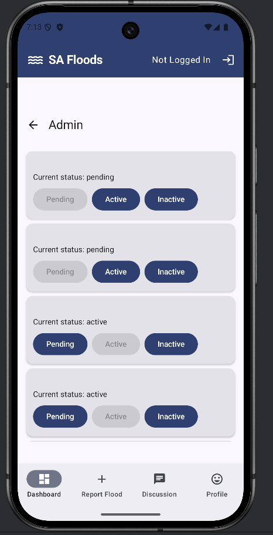
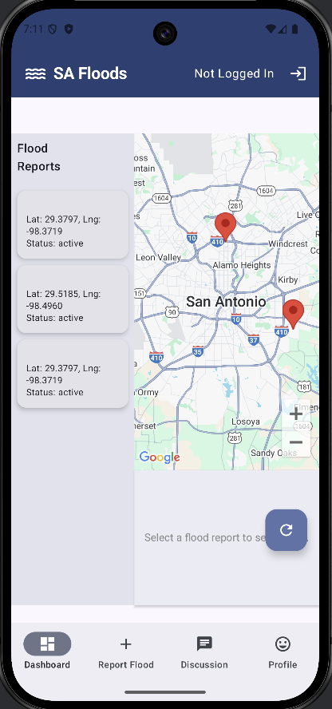
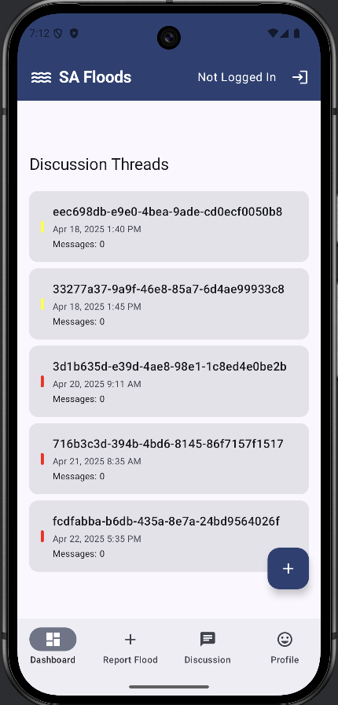
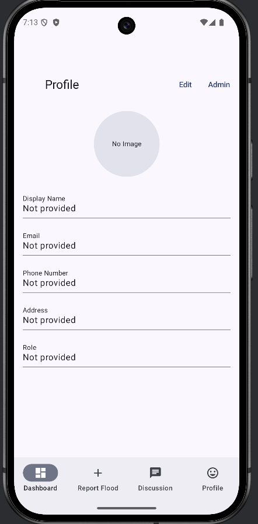
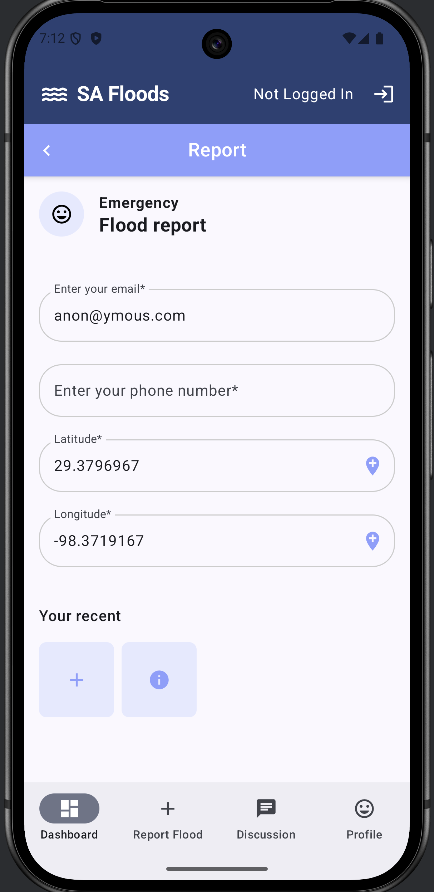

## SAFloodResponse - San Antonio Flood Response App

**Team Members:**
- Enrique Matta-Rodriguez <enrique.j.matta@utexas.edu>

**Repository**

* https://github.com/ematta/SAFloodResponse

### App Overview
SAFloodResponse is a community-driven Android application for real-time flood reporting, tracking, and response coordination in San Antonio, TX. It enables residents to report floods with location data, view reports on interactive maps, and participate in community discussions during emergency situations.

### APIs & Key Android Features Used

1. **Google Maps API**: Core to our application for displaying flood reports geospatially with custom markers and info windows. 

2. **Firebase APIs**:
   - Firebase Authentication API
   - Firestore Database API
   - Firebase Storage API
   - Firebase App Check API

3. **Android Features**:
   - **Jetpack Compose** used extensively throughout the application
   - Custom navigation drawer for app-wide navigation
   - Location services and GPS integration
   - Camera integration for photo capture
   - Material Design 3 components and animations

### App Images and Movie

The movie can be found [here](https://youtu.be/VTU6SCy6iWA).

<table>
  <tr>
    <td></td>
    <td></td>
    <td></td>
  </tr>
  <tr>
    <td></td>
    <td></td>
    <td></td>
  </tr>
</table>

### Third-Party Libraries

1. **Kotlin Coroutines & Flow**: Used for asynchronous programming throughout the application. This library significantly simplified our background operations for data fetching and processing, though we faced some challenges with proper scoping in certain ViewModels where lifecycle management required careful implementation.

2. **MockK**: Used for our testing framework to create mock objects. This library greatly enhanced our testing capabilities, particularly when simulating Firebase responses, although the learning curve was initially steep when working with coroutine-based suspend functions.

3. **Coil**: Use for our image management and manipulation. This library simplifies the process of handling images in the Android OS. We did face issues with posting to Firestore Storage which has not been resolved as of this writing. 

### Third-Party Services

1. **Firebase Authentication**: Provides user account management and security. Firebase Auth simplified our login workflow considerably, though we faced some challenges implementing proper error handling for edge cases like account linking and session timeouts.

2. **Firebase Firestore**: Real-time NoSQL database that stores all flood reports, discussions, and user data. The real-time capabilities were excellent for our use case, but we had to develop careful indexing strategies to manage query performance as our data grew.

3. **Firebase Storage**: Used for storing user-submitted photos of flood incidents. The integration with Firestore was seamless, though we had to implement custom compression and size limiting to optimize upload performance on varying network conditions.

5. **Google Maps Platform**: Used beyond just the Android SDK, leveraging their geocoding and place search APIs. These were critical for accurate location reporting, though cost management required implementing caching strategies.

### UI/UX Design Highlights

Our application employs a disaster-centric design philosophy focused on clarity and accessibility during emergency situations:

1. We implemented a high-contrast color system for flood severity indicators that works across accessibility needs, including color blindness considerations.

2. The app features offline capabilities for the map interface, storing recently viewed reports locally with clear indicators for possibly outdated information.

3. Our navigation structure prioritizes rapid reporting with a prominent floating action button that remains accessible throughout the app.

4. We implemented a custom location selection interface that combines map-based and text-based input methods to accommodate various user preferences and abilities.

### Backend Architecture Highlights

1. The application implements a multi-layer validation system for flood reports:
   - Client-side validation on submission
   - Server-side Firebase functions that verify location data
   - Community verification through confirmations/denials

2. We developed a custom geospatial simulation system that models flood spread based on topographical data and existing reports, using a modified cellular automaton approach.

3. Our data synchronization strategy implements intelligent background syncing that prioritizes critical reports over discussion updates, optimizing for limited bandwidth during emergency situations.

4. The authentication layer includes role-based permissions with administrator capabilities for official emergency responders.

### Most Valuable Learning Experience

1. **Full Project Lifecycle**: Completing an app from start to finish was an invaluable experience. Reaching an alpha release milestone provided unique insights into the entire development process. Since most of my professional work involves existing codebases, building something from scratch offered a fresh perspective on software development.

2. **Android Tech Stack**: Gaining proficiency with Android development has significantly expanded my capabilities as a developer. I now feel confident in my ability to develop various mobile applications for clients. While the course introduced fundamental concepts, my deeper exploration of the Android documentation revealed additional tools and processes that proved particularly valuable.

### Most Difficult Challenge

During development, I faced two significant challenges that impacted the project timeline and quality:

1. **Compressed Timeline Management**: The strict project deadline forced difficult trade-offs in development priorities. Most notably, I had to reduce UI testing coverage beyond what I consider professionally acceptable. This compromise, while necessary to meet deadlines, highlighted the importance of establishing realistic development scopes that accommodate proper testing phases.

2. **AI-Generated Code Accidents**: In an attempt to accelerate development, I experimented with using a specialized AI agent (DeepSeek v3 0324) for code generation. While initially promising, the generated code required extensive refactoring and debugging due to quality issues. What was intended as a productivity boost ultimately cost me three days of debugging time, teaching me valuable lessons about the current limitations of AI coding assistants and the importance of careful evaluation before integrating generated code.

### Build & Run Instructions

1. Clone the repository from GitHub
2. Create a `local.properties` file in the project root with the following:
   ```
   sdk.dir=/path/to/your/Android/sdk
   MAPS_API_KEY=your_google_maps_api_key
   ```
3. Create a Firebase project and add an Android app with package name `edu.utap.safloodresponse`
4. Download the `google-services.json` file and place it in the `app/` directory
5. In the Firebase console, enable:
   - Authentication (Email and Google sign-in)
   - Firestore Database
   - Storage
   - App Check
6. Enable the Maps SDK for Android in the Google Cloud Console associated with your Firebase project
7. Build and run the application using Android Studio

For testing purposes, you can use the debug mode which has sample data populated automatically.

### Code Statistics for SAFloodResponse App

#### Summary
- **Total Files**: 85 text files (83 unique files)
- **Files Ignored**: 12
- **Processing Time**: 0.15 s (562.4 files/s, 76913.1 lines/s)

#### By Language

| Language | Files | Blank | Comment | Code |
|----------|-------|-------|---------|------|
| Kotlin   | 64    | 795   | 3320    | 6859 |
| XML      | 19    | 22    | 25      | 330  |
| **TOTAL**| **83**| **817**| **3345**| **7189**|

#### Files by Size (Descending Code Lines)

| File | Blank | Comment | Code |
|------|-------|---------|------|
| app/src/main/java/edu/utap/ui/screens/discussion/DiscussionFormScreen.kt | 18 | 13 | 515 |
| app/src/main/java/edu/utap/ui/screens/discussion/DiscussionThreadScreen.kt | 32 | 37 | 508 |
| app/src/main/java/edu/utap/ui/screens/flood/FloodReportDetailScreen.kt | 23 | 10 | 418 |
| app/src/main/java/edu/utap/ui/viewmodel/DiscussionViewModel.kt | 58 | 48 | 374 |
| app/src/main/java/edu/utap/ui/screens/discussion/DiscussionListScreen.kt | 15 | 33 | 351 |
| app/src/main/java/edu/utap/ui/screens/profile/ProfileScreen.kt | 33 | 116 | 328 |
| app/src/main/java/edu/utap/ui/viewmodel/FloodReportViewModel.kt | 50 | 114 | 314 |
| app/src/main/java/edu/utap/ui/navigation/NavigationManager.kt | 19 | 13 | 267 |
| app/src/main/java/edu/utap/ui/screens/flood/FloodReportFormScreen.kt | 47 | 474 | 228 |
| app/src/main/java/edu/utap/ui/screens/dashboard/DashboardScreen.kt | 14 | 22 | 218 |
| app/src/main/java/edu/utap/ui/viewmodel/AuthViewModel.kt | 26 | 110 | 212 |
| app/src/main/res/drawable/ic_launcher_background.xml | 0 | 0 | 170 |
| app/src/main/java/edu/utap/ui/screens/flood/FloodReportMapListScreen.kt | 5 | 7 | 165 |
| app/src/main/java/edu/utap/ui/viewmodel/UserViewModel.kt | 23 | 137 | 164 |
| app/src/main/java/edu/utap/repository/AuthRepository.kt | 17 | 235 | 157 |
| app/src/main/java/edu/utap/utils/ImageCacheManager.kt | 18 | 51 | 153 |
| app/src/main/java/edu/utap/repository/FirestoreDiscussionRepository.kt | 21 | 219 | 122 |
| app/src/main/java/edu/utap/repository/FloodReportRepository.kt | 18 | 157 | 119 |
| app/src/main/java/edu/utap/ui/components/CacheAwareAsyncImage.kt | 9 | 19 | 105 |
| app/src/main/java/edu/utap/auth/FirestoreAuthRepository.kt | 21 | 93 | 103 |
| app/src/main/java/edu/utap/MainActivity.kt | 20 | 9 | 102 |
| app/src/main/java/edu/utap/ui/components/CommonComponents.kt | 11 | 36 | 99 |
| app/src/main/java/edu/utap/ui/screens/flood/FloodReportScreen.kt | 6 | 11 | 95 |
| app/src/main/java/edu/utap/ui/screens/admin/AdminScreen.kt | 4 | 0 | 91 |
| app/src/main/java/edu/utap/repository/UserRepository.kt | 17 | 61 | 90 |
| app/src/main/java/edu/utap/ui/components/FloodReportItem.kt | 8 | 8 | 85 |
| app/src/main/java/edu/utap/utils/FirebaseErrorMapper.kt | 16 | 45 | 81 |
| app/src/main/java/edu/utap/ui/viewmodel/FloodMapTestViewModel.kt | 12 | 11 | 73 |
| app/src/main/java/edu/utap/utils/CameraStoragePermissionHandler.kt | 16 | 34 | 72 |
| app/src/main/java/edu/utap/ui/components/AppHeader.kt | 3 | 9 | 70 |
| app/src/main/java/edu/utap/di/ViewModelFactory.kt | 4 | 23 | 66 |
| app/src/main/java/edu/utap/ui/NetworkConnectivitySnackbar.kt | 4 | 8 | 64 |
| app/src/main/java/edu/utap/ui/components/BottomNavigationBar.kt | 6 | 0 | 64 |
| app/src/main/java/edu/utap/utils/FirebaseStorageUtil.kt | 12 | 59 | 64 |
| app/src/main/java/edu/utap/utils/NetworkMonitor.kt | 14 | 16 | 61 |
| app/src/main/java/edu/utap/auth/NetworkOperationHandler.kt | 5 | 13 | 58 |
| app/src/main/java/edu/utap/di/DiscussionViewModelFactory.kt | 6 | 28 | 55 |
| app/src/main/java/edu/utap/utils/ImageCacheProvider.kt | 15 | 102 | 55 |
| app/src/main/java/edu/utap/utils/LocationPermissionHandler.kt | 8 | 147 | 55 |
| app/src/main/java/edu/utap/auth/AuthFlowManager.kt | 12 | 103 | 50 |
| app/src/main/AndroidManifest.xml | 7 | 1 | 49 |
| app/src/main/java/edu/utap/models/FloodReport.kt | 3 | 30 | 47 |
| app/src/main/java/edu/utap/di/FloodViewModelFactory.kt | 5 | 19 | 43 |
| app/src/main/java/edu/utap/utils/SecurePrefsProvider.kt | 11 | 78 | 42 |
| app/src/main/java/edu/utap/ui/theme/Theme.kt | 6 | 0 | 40 |
| app/src/main/java/edu/utap/utils/ValidationUtils.kt | 9 | 83 | 38 |
| app/src/main/java/edu/utap/models/FirestoreUser.kt | 2 | 22 | 31 |
| app/src/main/java/edu/utap/utils/LocationUtils.kt | 6 | 13 | 31 |
| app/src/main/res/drawable/ic_launcher_foreground.xml | 0 | 0 | 30 |
| app/src/main/java/edu/utap/repository/BaseRepository.kt | 6 | 89 | 28 |
| app/src/main/java/edu/utap/ui/viewmodel/AuthViewModelInterface.kt | 11 | 57 | 27 |
| app/src/main/java/edu/utap/ui/theme/Dimensions.kt | 7 | 6 | 25 |
| app/src/main/java/edu/utap/models/DiscussionThread.kt | 5 | 14 | 24 |
| app/src/main/java/edu/utap/utils/NetworkUtils.kt | 5 | 28 | 23 |
| app/src/main/java/edu/utap/FloodResponseApplication.kt | 2 | 27 | 22 |
| app/src/main/java/edu/utap/utils/RoleUtils.kt | 4 | 15 | 22 |
| app/src/main/java/edu/utap/auth/AuthStateManager.kt | 6 | 18 | 21 |
| app/src/main/java/edu/utap/auth/AuthState.kt | 11 | 48 | 20 |
| app/src/main/java/edu/utap/auth/UserProfileState.kt | 11 | 45 | 20 |
| app/src/main/java/edu/utap/ui/theme/Type.kt | 2 | 1 | 15 |
| app/src/main/java/edu/utap/di/DiscussionModule.kt | 4 | 14 | 14 |
| app/src/main/res/xml/file_paths.xml | 0 | 0 | 12 |
| app/src/main/java/edu/utap/models/UserProfile.kt | 1 | 15 | 11 |
| app/src/main/java/edu/utap/models/DiscussionMessage.kt | 2 | 9 | 10 |
| app/src/main/res/drawable/ic_smiley_face.xml | 0 | 0 | 10 |
| app/src/main/res/values/colors.xml | 0 | 0 | 10 |
| app/src/main/java/edu/utap/di/AuthModule.kt | 2 | 20 | 9 |
| app/src/main/java/edu/utap/utils/ApplicationContextProvider.kt | 3 | 6 | 9 |
| app/src/main/java/edu/utap/ui/theme/Color.kt | 3 | 0 | 8 |
| app/src/main/java/edu/utap/utils/StorageUtilProvider.kt | 2 | 32 | 8 |
| app/src/main/res/values/strings.xml | 0 | 0 | 7 |
| app/src/main/res/mipmap-anydpi-v26/ic_launcher_round.xml | 0 | 0 | 6 |
| app/src/main/res/xml/data_extraction_rules.xml | 0 | 14 | 5 |
| app/src/main/res/values/themes.xml | 1 | 0 | 4 |
| app/src/main/res/drawable/baseline_add_24.xml | 2 | 0 | 3 |
| app/src/main/res/drawable/baseline_add_location_24.xml | 2 | 0 | 3 |
| app/src/main/res/drawable/baseline_chat_24.xml | 2 | 0 | 3 |
| app/src/main/res/drawable/baseline_dashboard_24.xml | 2 | 0 | 3 |
| app/src/main/res/drawable/baseline_login_24.xml | 2 | 0 | 3 |
| app/src/main/res/drawable/baseline_tag_faces_24.xml | 2 | 0 | 3 |
| app/src/main/res/drawable/baseline_water_24.xml | 2 | 0 | 3 |
| app/src/main/res/xml/backup_rules.xml | 0 | 10 | 3 |
| app/src/main/res/xml/network_security_config.xml | 0 | 0 | 3 |

*Generated with [cloc](https://github.com/AlDanial/cloc) v2.04*
